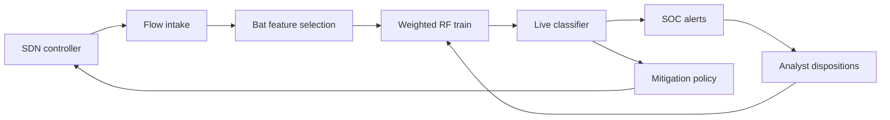

# CtrlForest

**Source:** `ai-in-iot/1806.02566v1/`
**Domain:** `ai-iot`
**One-liner:** A software-defined IoT intrusion platform that selects flow features with a swarm (Bat + differential mutation) then classifies attacks with a weight-adapted Random Forest under the SDN controller’s global view.
**Wedge:** Operators of SDN-controlled IoT fabrics (campus, industrial campus, smart-building backbones) who already centralize flow stats but still run signature IDS that miss novel probes.
**Positioning:** Controller-native two-stage IDS for SD-IoT. Misuse signatures cannot generalize; naive anomaly detectors flood false alarms. CtrlForest productizes the paper’s pipeline — improved Bat feature selection with K-means swarm division and Differential Mutation, then Random Forest with iterative sample reweighting and weighted voting — so the controller both observes and classifies with higher accuracy and lower overhead than prior swarm+RF baselines.

## Market research synthesis

### Thesis from source

Software Defined IoT (SD-IoT) gains centralized management and programmable resource allocation from SDN, but does not eliminate attacks. Classical IDS splits into misuse detection (signature match, fails on unknown attacks) and anomaly detection (deviation from normality, high false alarms). AI can learn patterns, yet prior combinations are not precise or robust enough for evolving SD-IoT.

The product wedge is architectural: SDN already collects flow statistics with a global view and can program forwarding — so intrusion detection should sit at the controller as a two-stage pipeline. Stage one selects typical features via an improved Bat algorithm that splits the swarm into K-means subgroups for within- and among-population learning and uses Differential Evolution to diversify individuals. Stage two classifies flows with Random Forest modified to update sample weights after each tree and decide by weighted voting. On KDD Cup 1999 evaluation, the proposed feature-selection algorithm reaches 96.03% accuracy with 1.18% false-positive rate versus BA 94.93%/3.68% and other swarm baselines; the full proposed classifier reports 99.51% precision, 95.17% recall, 97.29% F-score, and 0.98% FPR with lower computational cost than Decision Tree, AdaBoost, RF, SVM, and GBDT in their comparison table. Per-class detection covers Normal, Probe, DoS, U2R, and R2L.

### Buyer & economic model

- **Primary buyer:** CISO or Head of Network Security at enterprises running SDN-backed IoT fabrics; secondary: managed SD-WAN/IoT security MSSPs.
- **Users:** SOC analysts, SDN controller engineers, IoT platform owners, compliance auditors.
- **Budget owner / value metric:** security operations budget. Value metrics: detection rate by attack class, false-positive rate (analyst hours), controller CPU overhead, mean time to quarantine a flow.
- **Competing status quo:** signature IDS appliances on the edge; generic ML IDS outside the controller; SDN telemetry exported to SIEM without feature selection discipline.

### Domain constraints

- **Regulatory / trust / safety:** false negatives on DoS/U2R can be safety events in industrial IoT; automated flow drops need change-control and dual authorization in regulated environments.
- **Data sensitivity:** flow features can reconstruct site activity; feature stores and labeled attacks are sensitive.
- **Change-management realities:** controller plugins must not destabilize forwarding; feature sets drift as device mixes change and need re-selection without downtime.

## Business requirements

- BR-1: The platform must ingest flow statistics from the SDN controller’s global view and must not require a parallel tap as the primary path.
- BR-2: Feature selection must produce an auditable subset with fitness score; operators can freeze or re-run selection on a schedule.
- BR-3: Classification must report precision, recall, F-score, accuracy, and false-alarm rate per model version on a held-out eval set before promotion.
- BR-4: Production models must beat the customer’s incumbent signature IDS on novel-attack recall without exceeding an agreed FPR ceiling (default ≤1.5%).
- BR-5: Per-class performance for Normal, Probe, DoS, U2R, and R2L (or customer taxonomy mapping) must be visible to the SOC.
- BR-6: High-confidence attack classifications may trigger controller quarantine actions only when policy allows; default is alert-only.
- BR-7: Controller CPU/memory overhead of detection must be measured and bounded in the deployment profile.
- BR-8: Model and feature-set versions are immutable once promoted, with rollback.
- BR-9: Analysts must be able to mark false positives so sample weights improve in the next training cycle.
- BR-10: All automated mitigations must leave an audit trail suitable for change-control review.
- BR-11: Commercial packaging prices by flows/sec under analysis and controller domains, not by raw log volume alone.
- BR-12: Export of period detection statements must reconcile alerts, mitigations, and false-positive dispositions.

## User stories

Canonical user stories live in sibling [USER_STORIES.md](USER_STORIES.md).

## System design

### Overview

CtrlForest attaches to the SDN controller, continuously samples flow stats, runs swarm-based feature selection offline or on schedule, trains a weight-adapted Random Forest, scores live flows, emits SOC alerts, and optionally instructs the controller to quarantine flows under policy.

### Actors & boundaries

- **Actors:** SOC analysts, controller engineers, platform owners, auditors, the SDN controller, IoT endpoints (indirect).
- **Trust boundary:** the controller and CtrlForest share a secured management plane; IoT devices do not host the classifier. Labeled attack corpora stay in the customer security zone.
- **Human-in-the-loop points:** promotion of feature sets and models; enabling mitigation; false-positive labeling; rollback.

### Core capabilities

1. **Controller flow intake** — global flow statistic collection.
2. **Swarm feature selection** — Bat + K-means subgroups + Differential Mutation.
3. **Weighted forest training** — iterative sample weights and weighted voting.
4. **Live flow classification** — per-class scores and alerts.
5. **Mitigation policy** — optional quarantine via controller.
6. **Analyst feedback loop** — FP/FN dispositions into reweighting.
7. **Overhead and health monitoring** — controller resource bounds.
8. **Audit and period statements** — model/feature provenance.

### Conceptual data

- **Primary entities:** ControllerDomain, FlowSample, FeatureSet, ForestModel, DetectionAlert, MitigationAction, AnalystDisposition, OverheadReport, EvalReport.
- **Critical events:** feature selection completed, model promoted, alert raised, quarantine applied, FP marked, FPR ceiling breached, rollback.
- **Retention / audit needs:** alerts and mitigations retained for the incident and compliance window; flow samples retained only as needed for training with purpose limitation.

### Integrations (conceptual)

- **Systems of record:** SDN controllers (OpenDaylight/ONOS-class), SIEM, ticketing.
- **Upstream signals:** flow stats, threat intel (optional), device inventory.
- **Downstream actions:** alert webhooks, flow drop/redirect, ticket creation.

### High-level architecture

### Success metrics

- **Leading:** FPR, recall by class, feature-selection fitness, controller overhead.
- **Lagging:** analyst hours per true positive, quarantine MTTR, novel-attack incidents missed versus signature IDS.

## OpenAPI skeleton

Canonical HTTP surface lives in sibling `openapi.yaml`. Summarize here:

- **Base path:** `/v1/...`
- **Auth:** API key and/or Bearer JWT (operator)
- **Resource groups:** Domains, FeatureSets, Models, Alerts, Mitigations
