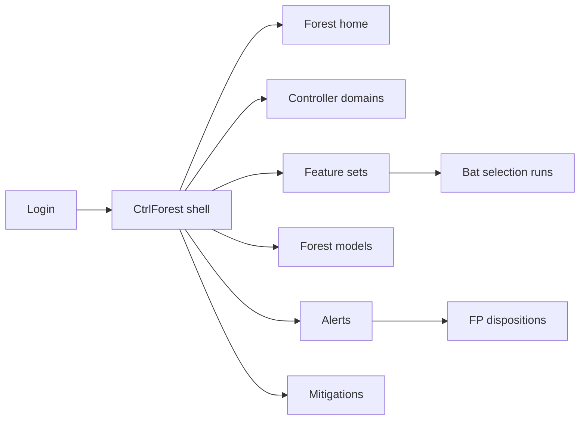
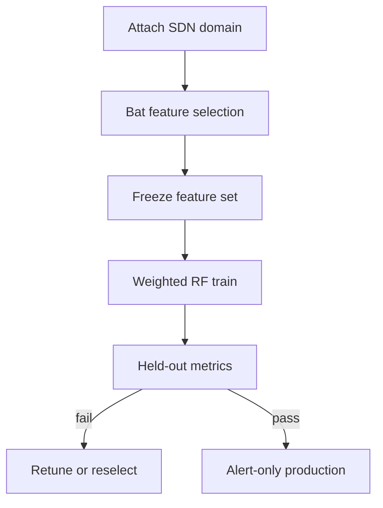
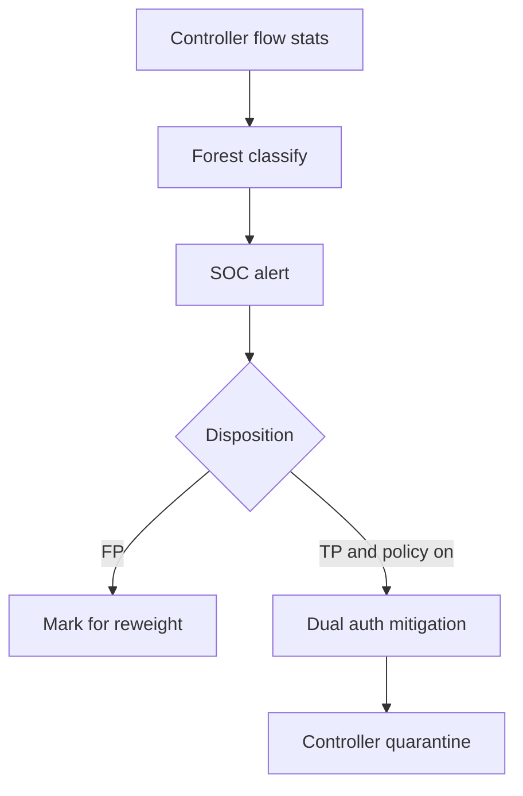

# CtrlForest — Web app

**Product:** [PRODUCT.md](./PRODUCT.md)
**Primary surface:** SD-IoT controller IDS console (SOC + SDN engineering under one CtrlForest shell)
**Secondary surfaces:** Period detection statement export (read-only); feature-set fitness audit viewer
**Design thesis:** CtrlForest is a two-stage forest in the SDN control plane — the UI metaphor is Bat-selected flow features feeding a weight-adapted Random Forest under the controller’s global view, not a bolt-on signature box beside the fabric. Visual language is deep canopy green-black with leaf-lime Normal calm and bark-coral Probe/DoS quarantine: alert-only is the default undergrowth; automated flow drops feel like gated axes that need dual authorization. The wordmark sits as a quiet lime seal on every feature-set and mitigation screen so operators know whose swarm-selected forest scored the flow.

## UX research synthesis

### Category peers (best-in-class)

- **Cisco Secure Network Analytics / Stealthwatch:** Flow-centric detections with host/group context and SIEM handoff. Steal: flow-first evidence without requiring payload DPI; reject signature-rule walls as the home — CtrlForest’s home is swarm feature fitness + per-class forest metrics.
- **ONOS / OpenDaylight applications UIs:** Controller apps with domain topology and intentional flow programming. Steal: controller-domain as primary nav and overhead budgets next to forwarding health (BR-7); reject generic “security dashboard” detached from the controller.
- **Darktrace / Vectra (NDR):** Novel-attack surfaces with analyst feedback loops. Steal: FP disposition into model reweighting (BR-9); reject black-box scores without contributing features and attack class (BR-5).
- **Snort/Suricata manager UIs (e.g., Security Onion):** Rule promotion, FPR awareness, and alert triage. Steal: alert-only default vs gated mitigation (BR-6); reject misuse-signature primacy for novel probes the paper targets.

### Patterns to adopt / reject

- **Adopt:** Controller-native flow intake (no parallel tap as primary); auditable Bat feature subsets with fitness; held-out precision/recall/F/FPR before promote; per-class Normal/Probe/DoS/U2R/R2L; alert-default quarantine; overhead bounds; immutable feature+model versions; FP marks → next weighted train; period statements reconciling alerts/mitigations/FPs.
- **Reject:** Parallel tap as required path; purple AI glow; auto-drop on day one; editable promoted forests; FPR-blind “more AI”; swarm chrome without fitness scores.

### Trust, density, and workflow constraints from PRODUCT.md

False negatives on DoS/U2R can be safety events; automated drops need change-control/dual auth in regulated environments (domain, BR-6, BR-10). Feature stores and labeled attacks are sensitive. Controller plugins must not starve forwarding (BR-7). Feature drift after device onboarding waves needs scheduled re-selection (BR-2). Beat signature IDS on novel recall without exceeding FPR ceiling (BR-4).

## Information architecture

### Nav model

### Roles → default home

| Role | Default home | Why |
|------|--------------|-----|
| SOC analyst | Alerts | Class + features triage (BR-5) |
| SDN controller engineer | Domains — overhead | Protect forwarding (BR-7) |
| IoT platform owner | Forest home vs signature | Novel recall proof (BR-4) |
| Compliance auditor | Mitigations audit / statements | Change-control (BR-10, BR-12) |
| Security administrator | Feature sets schedule | Drift re-selection (BR-2) |

### Cross-links to OpenAPI resources

| Nav area | OpenAPI tags / resources |
|----------|---------------------------|
| SDN controller domains | Domains |
| Bat-selected subsets | FeatureSets |
| Weight-adapted RF | Models |
| Live classifications | Alerts |
| Quarantine / flow actions | Mitigations |

## Screen inventory

### Forest home

- **Purpose:** Answer “is the controller forest beating signatures on novel attacks without flooding FPR or CPU?” in one composition.
- **Entry:** Platform owner / admin default; deep link from FPR ceiling breach.
- **Layout regions:** Brand chrome; KPI strip (FPR vs ceiling, recall by class, novel-attack lift vs signature, controller overhead %, open mitigations); domain health; alerts rail.
- **Primary actions:** Open alerts; open feature re-selection; open rollback.
- **Empty / loading / error:** Empty = attach first controller domain; error = retry with request id.
- **BR / story ties:** BR-4, BR-7; platform owner story.

### Controller domains

- **Purpose:** Attach SD-IoT domains; ingest global flow stats as primary path; show overhead budget.
- **Entry:** Domains nav; engineer default secondary.
- **Layout regions:** Domain table (flows/sec, overhead vs budget, active feature set, model version, mitigation policy flag); intake status (controller-native vs accidental tap-only warning).
- **Primary actions:** Register domain; set overhead bound; toggle mitigation policy (default off).
- **Empty / loading / error:** Parallel-tap-only = amber “not primary path” (BR-1).
- **BR / story ties:** BR-1, BR-7, BR-11.

### Feature sets (Bat selection)

- **Purpose:** Run/schedule improved Bat + K-means + Differential Mutation selection; freeze auditable subsets with fitness.
- **Entry:** FeatureSets nav; admin schedule path.
- **Layout regions:** Selection runs (fitness, size, timestamp); selected feature list; freeze/re-run controls; post-onboarding schedule.
- **Primary actions:** Run selection; freeze; schedule; compare fitness to prior.
- **Empty / loading / error:** Unfrozen drift warning after major inventory change.
- **BR / story ties:** BR-2; security admin re-selection story.

### Forest models

- **Purpose:** Train weight-adapted RF; show held-out metrics; promote immutably; rollback.
- **Entry:** Models nav.
- **Layout regions:** Model list (metrics, feature-set pin, overhead estimate); per-class table; promote gate vs FPR ceiling and signature baseline; rollback.
- **Primary actions:** Train; promote; rollback; export eval.
- **Empty / loading / error:** Promote blocked if FPR > ceiling or eval missing (BR-3, BR-4).
- **BR / story ties:** BR-3, BR-8.

### Alerts

- **Purpose:** Live flow classifications with attack class and contributing features for triage.
- **Entry:** SOC default; Alerts nav.
- **Layout regions:** Queue (class Probe/DoS/U2R/R2L/Normal miss, confidence, domain, features); evidence pane; mark FP/FN; optional request mitigation.
- **Primary actions:** Disposition; ticket; request quarantine (policy-gated).
- **Empty / loading / error:** Empty healthy message; FPR flood = ceiling breach banner.
- **BR / story ties:** BR-5, BR-9; SOC stories.

### Mitigations

- **Purpose:** Optional controller quarantine; default alert-only; dual-auth where required; full audit trail.
- **Entry:** Mitigations nav; from alert action.
- **Layout regions:** Policy flag (alert-only vs allow quarantine); pending dual-auth queue; active flow drops/redirects; audit rail (who/when/model version).
- **Primary actions:** Approve quarantine; release; export audit.
- **Empty / loading / error:** Mitigation without policy = blocked; unreviewed auto-drop = coral compliance state.
- **BR / story ties:** BR-6, BR-10; auditor stories.

### Analyst disposition → reweight

- **Purpose:** FP marks feed next weighted-forest training cycle.
- **Entry:** From Alerts → Dispositions; model train input.
- **Layout regions:** Disposition inbox; impact preview on sample weights; link to next train job.
- **Primary actions:** Bulk confirm FPs; queue retrain.
- **Empty / loading / error:** Dispositions without retrain schedule = amber hygiene nudge.
- **BR / story ties:** BR-9.

### Overhead health

- **Purpose:** Bound controller CPU/memory of detection so forwarding is not starved.
- **Entry:** Domain detail; engineer home shortcut.
- **Layout regions:** Overhead time series vs budget; refuse-promote when over profile; correlation to feature-set size.
- **Primary actions:** Tighten bound; rollback heavy model.
- **Empty / loading / error:** Missing metrics = cannot promote (BR-7).
- **BR / story ties:** BR-7; controller engineer stories.

### Period detection statement

- **Purpose:** Reconcile alerts, mitigations, and FP dispositions for the period.
- **Entry:** Export from home/audit; auditor secondary.
- **Layout regions:** Counts by class; mitigation list with model/feature versions; FP rate; download.
- **Primary actions:** Generate; download; mark reviewed.
- **Empty / loading / error:** Empty period = zero detections message.
- **BR / story ties:** BR-12.

## Key flows

1. **Stand up controller IDS** — attach domain → Bat feature select → train weighted RF → eval gate → alert-only go-live; failure: overhead over budget or FPR over ceiling.

2. **Alert to optional quarantine** — classify flow → SOC triage → if policy+dual-auth → controller mitigation → audit; default stays alert-only (BR-6).

3. **Post-onboarding re-selection** — schedule Bat run → compare fitness → freeze → retrain (BR-2).

4. **FPR ceiling breach** — 24h breach → auto-suggest rollback → admin confirms (admin story / BR-8).

5. **Period statement** — reconcile alerts, mitigations, FPs for auditors (BR-12).

## Design system

### Tokens (CSS variables)

- `--color-ink: #E8F0EA` — primary text
- `--color-canopy-950: #07110C` — app ground
- `--color-canopy-900: #0F1C16` — panels
- `--color-canopy-700: #2A4036` — rules
- `--color-leaf: #7CDB6A` — Normal / fitness ok / promote
- `--color-leaf-dim: #3F7A38` — leaf on dark
- `--color-amber: #E6A23C` — alert-only / drift / overhead warn
- `--color-coral: #E85D4C` — attack class / quarantine / FPR breach
- `--color-steel: #8AA898` — secondary labels
- `--color-brand: #A8E09A` — CtrlForest wordmark
- `--font-display: "IBM Plex Sans", sans-serif`
- `--font-mono: "IBM Plex Mono", monospace` — flow keys, feature ids, model versions
- `--space-1`…`--space-8`: 4px scale
- `--radius-sm: 4px`; `--radius-md: 8px`
- `--motion-score: 160ms ease-out` — classification flash
- `--motion-mitigate: 220ms ease-in-out` — quarantine confirm
- `--motion-swarm: 300ms linear` — feature-selection progress
- Atmosphere: subtle vertical “tree ring” hairlines in canopy-900; no purple cyber-forest stock art.

### Typography & brand

- Display for FPR/recall KPIs; mono for feature names and flow cookies.
- Brand on feature-set and mitigation views; login: “Select the features, weight the forest.”

### Do / don’t

- **Do:** Controller-native intake; show fitness; alert-default mitigation; per-class metrics; FP→reweight loop; overhead bounds.
- **Don’t:** Purple AI glow; auto-drop without policy; parallel tap as required; edit promoted models; hide contributing features.

### Accessibility & domain trust cues

- AA+ on leaf/coral; attack classes labeled in text, not color alone.
- Live regions for FPR ceiling and mitigation applies.
- Focus: domains → features → models → alerts → mitigations → statements.

## Component patterns

- **FeatureFitnessCard** — Bat subset size + fitness + freeze state.
- **PerClassMetricTable** — Normal/Probe/DoS/U2R/R2L precision/recall/FPR.
- **ContributingFeaturesList** — explainability on alerts.
- **AlertOnlyPolicyBanner** — default mitigation off.
- **DualAuthMitigation** — gated controller quarantine.
- **OverheadBudgetMeter** — CPU/mem vs deployment profile.
- **FpDispositionChip** — feeds next weighted train.
- **SignatureCompareStat** — novel recall vs incumbent IDS.
- **PeriodDetectionStatement** — alerts + mitigations + FP reconcile.
- **ImmutableModelPin** — feature-set + forest version lock.

## Out of scope for v1 web

- Full SDN fabric designer; payload DPI malware sandbox; endpoint EDR agents on IoT; MSSP multi-tenant white-label portal; replacement of enterprise SIEM; Bat hyperparameter research notebook as the primary UX.
